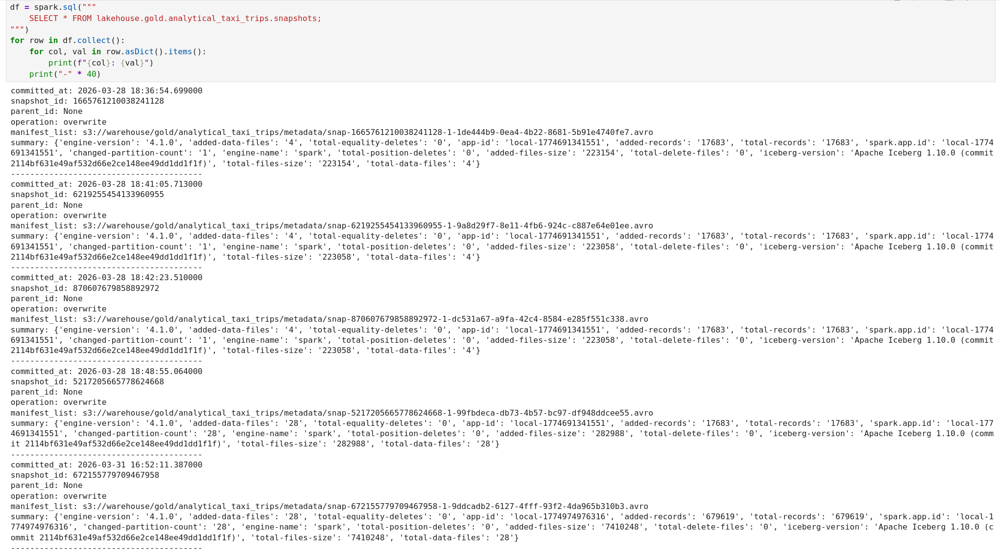
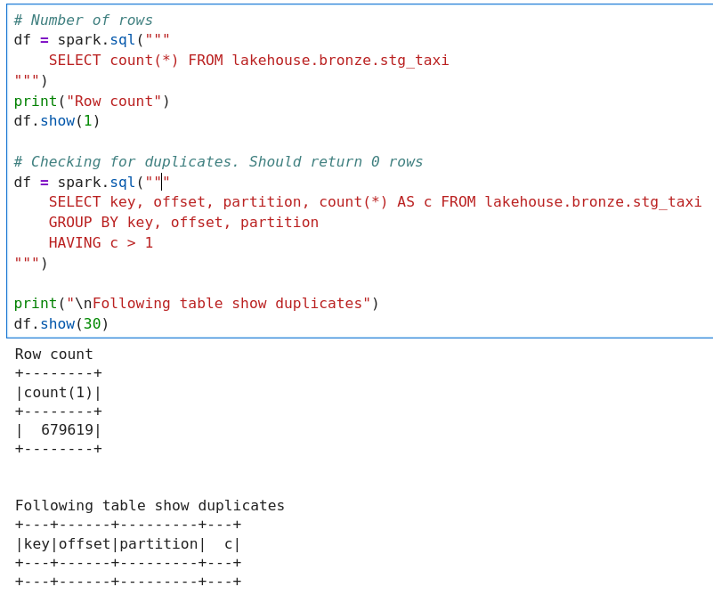
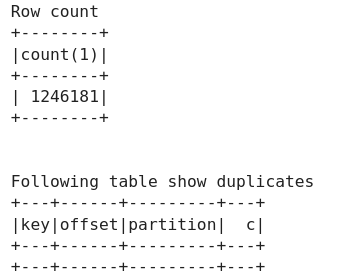
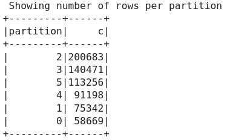

# Project 2: Streaming Lakehouse Pipeline

## 1. Medallion layer schemas

### Bronze

The bronze table ingests raw taxi trip records directly from Kafka without transformation, preserving the original payload for auditability and reprocessing.

Each row represents a single Kafka message: value holds the raw JSON trip payload, key contains the PULocationID (pickup location, custom scenario), and kafka_time captures the ingestion timestamp. offset and partition are Kafka-native fields that together uniquely identify a message's position within the topic, enabling replay and deduplication if needed.

It's kept as is because it is easy to ingest.

```SQL
CREATE TABLE IF NOT EXISTS lakehouse.bronze.stg_taxi (
        kafka_time TIMESTAMP,
        key STRING,
        offset INT,
        partition INT,
        value STRING
    ) USING iceberg
```
### Silver

All values are taken out from the json object, cleaned and cast into suitable datatypes. PU and DO taxi zones were joined into trip source data. Silver layer data should be ready to use for data engineers.

```SQL
CREATE OR REPLACE TABLE lakehouse.silver.fct_taxi_trip (
    VendorID INT,
    RatecodeID INT,
    PULocationID INT,
    DOLocationID INT,
    tpep_pickup_datetime TIMESTAMP,
    tpep_dropoff_datetime TIMESTAMP,
    passenger_count INT,
    trip_distance DOUBLE,
    store_and_fwd_flag STRING,
    payment_type INT,
    fare_amount DOUBLE,
    extra DOUBLE,
    mta_tax DOUBLE,
    tip_amount DOUBLE,
    tolls_amount DOUBLE,
    improvement_surcharge DOUBLE,
    congestion_surcharge DOUBLE,
    Airport_fee DOUBLE,
    cbd_congestion_fee DOUBLE,
    total_amount DOUBLE,
    PU_Zone STRING,
    PU_Borough STRING,
    PU_service_zone STRING,
    DO_Zone STRING,
    DO_Borough STRING,
    DO_service_zone STRING
) USING iceberg
```
### Gold

The goal was to find the most expensive trips by pickup location. By expensive we mean the most expensive per minute of ride.

First we created a sub table on which we applied partitioning and created 2 extra columns.
```SQL
CREATE OR REPLACE TABLE lakehouse.gold.analytical_taxi_trips
USING ICEBERG
PARTITIONED BY (months(tpep_pickup_datetime), bucket(16, PU_Zone))
AS
SELECT
    tpep_pickup_datetime,
    tpep_dropoff_datetime,
    PU_Zone,
    PU_Borough,
    PU_service_zone,
    total_amount,
    CAST(ROUND((unix_timestamp(tpep_dropoff_datetime) - unix_timestamp(tpep_pickup_datetime)) / 60.0) AS INT) AS trip_duration_minutes
FROM lakehouse.silver.fct_taxi_trip
WHERE tpep_pickup_datetime IS NOT NULL
    AND tpep_dropoff_datetime IS NOT NULL
```
Then the following aggregation was done to answer the question we thought of. Here we just do some within column aggregations such as `ROUND(avg(trip_duration_minutes), 2) AS avg_trip_duration_minutes` and within row aggregations like `total_fee / NULLIF(trip_duration_minutes, 0)`. The fields are grouped on a partitioned field: `PU_Zone`.

```SQL
SELECT 
    PU_Zone,
    ROUND(avg(total_amount / NULLIF(trip_duration_minutes, 0)), 2) AS avg_minute_fee,
    count(*) AS number_of_trips,
    ROUND(avg(trip_duration_minutes), 2) AS avg_trip_duration_minutes
FROM lakehouse.gold.analytical_taxi_trips
WHERE date_trunc('month', tpep_pickup_datetime) = '2025-01-01' 
GROUP BY PU_Zone
ORDER BY avg_minute_fee DESC
```

## 2. Cleaning rules and enrichment

Numberic and string fields were cleaned of nulls. In case of Numeric fields we set them to 0 with the exception of the `total_amount` field which we fill with the sum of all other fee fields when it is missing.

 The deduplication on key level happens in bronze layer where we ingest the data. In case when there are 2 messages with the same key, the merge strategy should take care of the duplicate.

The enrichment step is done after cleaning up the taxi trip data. There we do 2 left joins on different keys to add the fields which we also alias appropriately. 

## 3. Streaming configuration

Checkpoint path: `/tmp/chk-iceberg` - Stores the streaming state. If an update runs successfully it stores the new offsets, if not the next run will try to continue from the last checkpoint. 

Trigger interval: `5s` - If too big then the microbatches get too big, too small and it is inefficient and can clog up due to overhead. 5s seemed sensible for now.

Output mode: `update` - Allows restarting the sync without having to worry about duplicates. Complete gets slow and expensive for larger tables. Append is not restart duplicate proof.

Watermark: `did not use it` - Wasn't needed

## 4. Gold table partitioning strategy

Partitioning by months for faster querying, filtering when only looking at a specific time period. Assuming in a real world case we would have more data than just January and February.
Also partitioning by PU_Zone because this field is central to the table and will be used often.




## 5. Restart proof

Here is the row and duplicate counts before the restart:


And here it is after


## 6. Custom scenario

This was done:
- The key was changed to `PULocationID` in `produce.py`
- The topic was recreatd with 6 partitions

Q: "In REPORT.md, query the bronze table to show how rows are distributed across partitions and explain what ordering guarantees this partitioning provides"



Since all the pickup locations are contained in their partitions, the ordering of taxi trips per pickup location is guaranteed.

## 7. How to run

```bash
# Step 1: Start infrastructure
docker compose up -d

# Step 2: Create the taxi-trips topic

docker exec kafka sh -c "/opt/kafka/bin/kafka-topics.sh \
  --bootstrap-server localhost:9092 \
  --create --topic taxi-trips --partitions 6 --replication-factor 1"


# Step 3: Start the producer
python produce.py

# Step 4: Run the pipeline
Open Jupyter notebook at: http://localhost:8888/lab/tree/project/project_02.ipynb
Run all cells
```

env values (I know these shouldn't be in git):
```bash
MINIO_ROOT_USER=admin
MINIO_ROOT_PASSWORD=p2bdmparool
JUPYTER_TOKEN=p2bdm
```